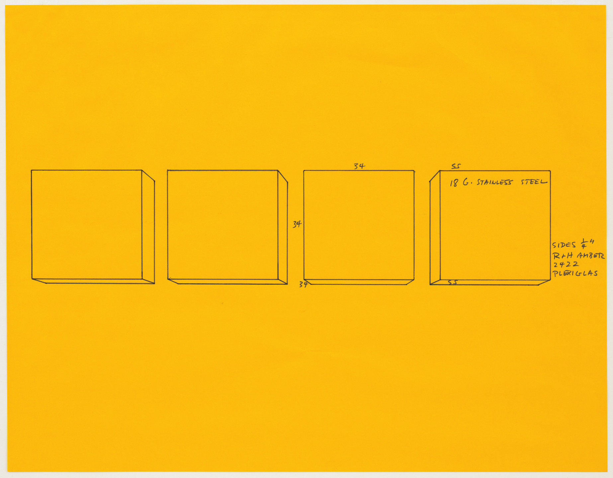

# Ressources supplémentaires

- [The Laws of UX](https://lawsofux.com/)
- [The Gestalt Principles for User Interface Design](https://www.youtube.com/watch?v=DwR0SZTBMTU)
- [Apple HIG](https://developer.apple.com/design/human-interface-guidelines/foundations)
- [Material Design Foundations](https://m3.material.io/foundations)