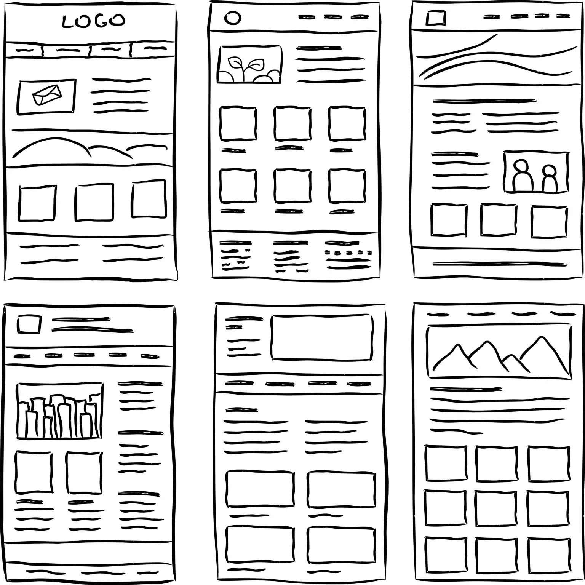

# Maquette fil de fer

Une maquette fil de fer est un prototype rudimentaire qui permet de tester plusieurs idées quant à l'expérience utilisateur d'un site Web. Son but est de mettre en place les grandes lignes d'une interface graphique sans avoir à s'attarder sur des détails de style ou de couleur. On peut réaliser une maquette fil de fer comme une rapide esquisse sur papier ou sous une forme digitale plus élaborée. L'important est de garder le niveau de fidélité assez bas pour permettre une itération rapide.

Durant cette phase de prototypage, concentrez-vous sur la taille et l'emplacement des éléments. Utilisez les principes de la Gestalt de sorte à regrouper les éléments qui sont connexes, et à guider le regard des utilisateur·rices vers les régions les plus importantes de la page.

Tout en concevant les maquettes en fil de fer, il peut aussi être utile d'imaginer des récits, des descriptions détaillées ou un guide « pas à pas » de la maquette pour offrir une alternative sous forme textuelle. Le maquettage est ainsi plus accessible, et permet d'imaginer comment l'interface peut être présentée de différentes manières.

## Ressources supplémentaires

- [Guide pour conception inclusive : Le prototypage](https://guide.inclusivedesign.ca/fr/outils/le-prototypage/)
- [Guide pour conception inclusive : Les fils de fer](https://guide.inclusivedesign.ca/fr/outils/les-fils-de-fer/)
- [NN/g : 5 Principles of Visual Design in UX](https://www.nngroup.com/articles/principles-visual-design/)
- [Adobe : Wireframe Design 101](https://xd.adobe.com/ideas/process/wireframing/wireframe-design-101/)
