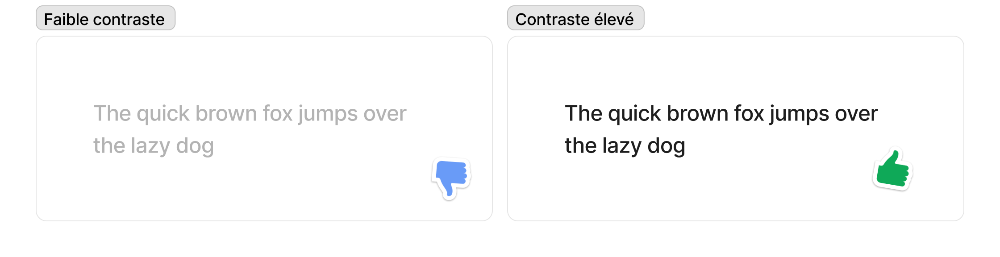
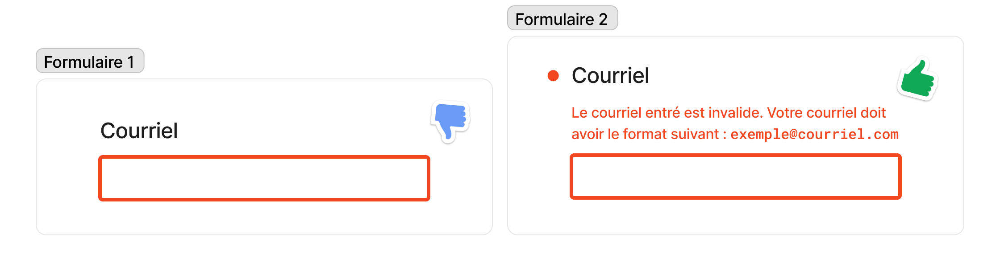
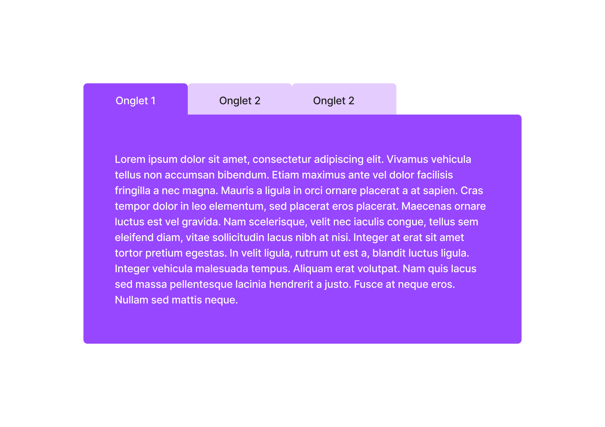
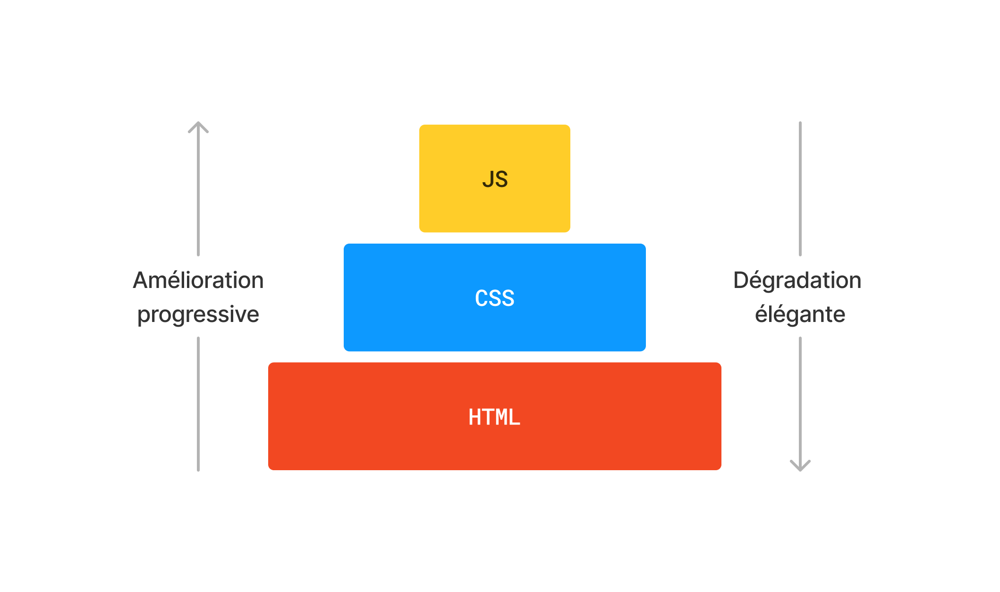

# L’accessibilité sur le Web

Dans le contexte du Web, l’accessibilité signifie rendre votre site Web à la disposition de tous et toutes, qu’ils ou elles aient un handicap ou non, un appareil mobile ou un ordinateur, une connexion internet à haut ou faible débit. De la même manière qu’il est inacceptable d’empêcher une personne en fauteuil roulant d’accéder à un bâtiment, il est inacceptable d’empêcher une personne qui a des troubles de la vue, ou qui ne possède pas le tout dernier navigateur, d’accéder à un site Web.

## 1. HTML et accessibilité

Heureusement, le Web est accessible *par défaut*. C’est-à-dire qu’un site Web qui utilise du HTML sémantique[^1] pour baliser son contenu nécessite peu ou pas de travail supplémentaire pour que tous et toutes y aient accès. Les problèmes arrivent lorsque les mauvais éléments HTML sont utilisés, ou lorsque la séparation entre forme et fond n’est pas respectée.

Prenons l’exemple suivant :

```html
<h1>Mon titre</h1>
<section>
	<h2>Première section</h2>
	<p>Ceci est la <em>première</em> sous-section de mon document.</p>
	<p>Je vais ajouter ici un autre paragraphe.</p>
	<ul>
	  <li>Voici</li>
	  <li>une liste</li>
	  <li>d’éléments</li>
	  <li>non-ordonnés</li>
	</ul>
</section>
<section>
	<h2>Deuxième section</h2>
	<p>Ceci est la seconde sous-section de mon document.</p>
</section>
```

Ci-haut, le HTML est dit « sémantique » car chaque élément est balisé selon son rôle dans la structure du document. Si vous y naviguez à l’aide d’un lecteur d’écran, vous verrez qu’il est simple de s’y retrouver. Les titres, les paragraphes, les listes seront tous identifiés comme tel, et il sera possible de se déplacer dans le document à l’aide d’une table des matières créée automatiquement.

*Visuellement*, une page similaire peut aussi être obtenue à l’aide du HTML suivant :

```html
<style>
	.list p {
		margin: 0 0 0 1rem;
	}

    .list p:before {
      content: "• "
    }
</style>

<p style="font-size: 2rem">Mon titre</p>
<div>
	<p style="font-size: 1.5rem">Première section</p>
	<p>Ceci est la <span style="font-style: italic">première</span> sous-section de mon document.</p>
	<p>Je vais ajouter ici un autre paragraphe.</p>
	<div class="list">
	  <p>Voici</p>
	  <p>une liste</p>
	  <p>d’éléments</p>
	  <p>non-ordonnés</p>
	</div>
</div>
<div>
	<p style="font-size: 1.5rem">Deuxième section</p>
	<p>Ceci est la seconde sous-section de mon document.</p>
</div>
```

Mais vous remarquerez que le code ci-haut n’offre pas une expérience comparable pour ceux et celles qui utilisent un lecteur d’écran. Celui-ci n’a plus de repères pour identifier la structure du document. La page entière est donc vue comme un bloc unique, lu tout d’une traite.

[^1]: Le mot « sémantique » renvoie à quelque chose qui signifie, indique, fait connaître. On parle de HTML sémantique lorsque les balises utilisés *marque la signification* de leur contenu. Ainsi, la balise `<nav>` indique que ce qu’elle contient est une navigation. À l’opposé, la balise `<div>`, qui n’a aucune signification, n’identifie pas son contenu.

## 2. CSS et Javascript

CSS et JavaScript n’ont pas la même importance en matière d’accessibilité que le HTML, mais leur mauvaise utilisation peuvent grandement nuire à l’accessibilité d’un site Web. C’est pourquoi il est important de prendre connaissance des bonnes pratiques suivantes, et idéalement, de bien les suivre.

### 2.1. Respecter les attentes des utilisateur·rices

L’importance du HTML sémantique est justifié entre autres par les attentes des utilisateurs et des utilisatrices. Les éléments d’une page Web ont une apparence et un comportement particuliers selon leurs fonctionnalités. Ces apparences et ces comportements forment des *conventions* qu’il est important de respecter.

Par exemple, un ou une utilisatrice de lecteur d’écran ne peut pas proprement naviguer dans une page Web si le ou la développeuse n’a pas utilisé les éléments de titre appropriés pour annoter le contenu. De la même manière, un titre perd son utilité visuelle si vous le stylisez de sorte qu’il ne ressemble plus à un titre.

Autrement dit, vous pouvez changer le style et le comportement de votre site Web à condition que ceux-ci ne rompent pas inutilement les habitudes et les attentes des utilisateur·rices.

### 2.2. Couleur et contraste



Lorsque vous choisissez un jeu de couleurs pour votre site Web, assurez-vous que la couleur du texte contraste bien avec la couleur de fond. Votre page peut *vous* sembler lisible et agréable, mais ne pas l’être, par exemple, pour ceux et celles atteintes de daltonisme.

Il existe des outils de vérification du contraste en ligne qui peuvent vous aider à faire un choix de couleurs qui ne causera pas de problème à vos utilisateur·rices. Par exemple, [le vérificateur de contraste de couleur du WebAIM](https://webaim.org/resources/contrastchecker/) est simple à utiliser et explique comment vous conformer aux critères WCAG relatifs au contraste des couleurs.



Un autre conseil est de ne pas compter *uniquement* sur la couleur pour transmettre un état ou de l’information à vos utilisateurs et utilisatrices. Par exemple, au lieu d’indiquer une erreur dans un formulaire en changeant seulement la couleur des champs à corriger, ajoutez également une note au début du formulaire qui explique l’erreur, et ce qu’il faut faire pour l’adresser.

### 2.3. Cacher des choses



Parfois, il est nécessaire (ou, du moins, nécessaire au dire du designer ou du client) de ne pas afficher tout le contenu d’une page en même temps. Prenez la boîte d’information à onglets ci-haut, laquelle contient trois panneaux différents. Nous pourrions réaliser celle-ci de plusieurs façons ; par exemple, en cachant les panneaux 2 et 3 à l’aide de la règle CSS `display: none` ou `visibility: hidden`. Le problème est que masquer du contenu de cette façon le rend inaccessible au lecteur d’écran. Dans ce cas, il est préférable de positionner les panneaux un sur l’autre à l’aide du positionnement absolu, ou de choisir une mise en page mieux adaptée.

<details>
<summary>

#### 2.3.1. Exercise

</summary>

1. Reproduisez la boîte d’information illustrée plus haut en utilisant les bonnes balises HTML, et en respectant les conseils d’accessibilité précédemment discutés.
2. Concevez une autre mise en page qui contient les mêmes informations, mais dont l’intégration est plus facile à rendre accessible pour tous et toutes.

</details>

### 2.4. Le problème avec (trop de) Javascript

Concernant Javascript, les problèmes d’accessibilité surviennent lorsqu’il est *trop* utilisé. Quoiqu’il est possible de créer un site Web avec Javascript seulement — en générant tout le HTML et le CSS avec celui-ci —, cela peut causer toutes sortes de soucis d’accessibilité que les navigateurs prennent normalement en charge pour vous. C’est pourquoi il est important de choisir la bonne technologie pour le bon travail.

## 3. Amélioration progressive et dégradation élégante



HTML et CSS sont des langages *déclaratifs*. Ils permettent de déclarez le *quoi* d’une page Web, sans avoir à préciser le *comment*. À l’aide de balises et de règles, vous décrivez le contenu et l’apparence de votre site Web, et c’est au navigateur que revient la tâche d’afficher celui-ci du mieux qu’il peut.

JavaScript est un langage *impératif*. Il permet de décrire la *structure de contrôle* d’un programme, c’est-à-dire la suite d’instructions qui devra être exécutée pour son bon fonctionnement. Contrairement à un document HTML ou à une feuille de style, un programme Javascript qui contient une erreur ne peut être exécuter proprement. Si l’erreur est au milieu du programme, ou bien si le navigateur d’un·e utilisateur·rice ne supporte pas la même version de Javascript que vous, alors le code ne s’exécutera pas.

Pour adresser ce problème, il est conseillé de concevoir votre site Web de façon à ce qu’il s’*améliore progressivement* lorsque Javascript est disponible, et qu’il se *dégrade élégamment* dans le cas contraire.

### 3.1. Amélioration progressive

L’amélioration progressive est une manière de concevoir un site Web en s’appuyant d’abord et avant tout sur la technologie la plus *robuste* du Web — le HTML —, et d’améliorer ensuite celui-ci avec, en ordre, des feuilles de style et des scripts. En séparent strictement le fond (HTML), la forme (CSS), et les fonctionnalités interactives (Javascript), tous et toutes peuvent avoir accès à un *service minimum*, même si une erreur se glisse dans votre script, ou si vos feuilles de style sont désactivées.

Implémenter l’amélioration progressive est autant un exercice de *réflexion* que de *programmation*. La première chose à faire est d’identifier quel *service minimum* doit offrir chacune de vos pages. Un formulaire, par exemple, doit, au minimum, permettre aux utilisateur·rices de soumettre leurs réponses. La soumission doit donc être possible sans CSS ni Javascript. Une fois ce service mis en place de façon robuste, on peut alors l’améliorer en y ajoutant du style et des fonctionnalités interactives côté client.

En résumé, assurez-vous, d’abord, que ça fonctionne, et, ensuite, que ça fonctionne mieux. En concevant vos pages Web de sorte que les parties autres que le HTML sont facultatives, vous produirez un site Web qui est plus robuste et accessible.

<details>
<summary>

#### 3.1.1. Exercise

</summary>

Concevez la navigation d’un simple site Web de sorte que celle-ci s’améliore progressivement. Quel est le service minimum que doit offrir une barre de navigation ? Commencez par le balisage HTML, puis ajoutez ensuite le CSS, et enfin le Javascript. Assurez-vous que votre navigation fonctionne sur des écrans de toutes tailles.

</details>

### 3.2. Dégradation élégante

La dégradation élégante désigne une façon de concevoir un système de sorte que celui-ci soit tolérant aux pannes ou aux erreurs. Par exemple, un escalier roulant qui tombe en panne se transforme simplement en escalier.

De la même façon, le HTML et le CSS sont conçu pour se dégrader élégamment lorsque les choses tournent mal. Leur gestion souple des erreurs fait en sorte que le navigateur ignore ce qu’il ne comprend pas et continue de fonctionner plutôt que de s’arrêter comme il le ferait pour du Javascript.

Par exemple, si un navigateur ne prend pas en charge l’élément `<video>` (ou, d’ailleurs, tout autres éléments), il affiche le contenu à l’intérieur de celui-ci, et continue d’évaluer le reste du code HTML sans problème.

```html
<video>
	<source src="video.webm" type="video/webm" />
  	<source src="video.mp4" type="video/mp4" />
	<p>C’est pourquoi il est conseillé d’inclure un transcript du vidéo ici.</p>
</video>
```

Il en va de même pour le CSS : 

```css
div {
	border-radius: 3px;
	background-color: blue;
}
```

Si un navigateur ne prend pas en charge la propriété `border-radius`, il l’ignorera simplement et utilisera plutôt des coins angulaires.

## 4. WAI-ARIA

Ayant pris connaissance des informations ci-haut, il peut sembler impossible de créer des interfaces complexes qui ne se conforment pas aux balises HTML, ou du contenu dynamique mis à jour par JavaScript. WAI-ARIA (*Web Accessibility Initiative – Accessible Rich Internet Applications*) est une technologie qui peut aider à résoudre de tels problèmes en ajoutant une sémantique supplémentaire que les navigateurs et les technologies d’assistance peuvent reconnaître et utiliser pour informer les utilisateurs de ce qui se passe.

### 4.1. La première règle d’ARIA

La première règle d’ARIA (et la plus importante) est la suivante : 

> Si vous pouvez utiliser un élément natif HTML ou un attribut avec la sémantique et le comportement voulu qui existe nativement, faites-le plutôt que d’utiliser un autre élément en lui ajoutant un rôle, un état ou une propriété ARIA afin de le rendre accessible.

Autrement dit, la première règle d’ARIA est de ne pas utiliser ARIA, sauf si absolument nécessaire. Bien qu’ARIA soit conçu pour rendre les pages web plus accessibles, lorsqu’il est utilisé incorrectement, il fait plus de mal que de bien. Lors d’un [sondage WebAIM](https://webaim.org/projects/million/#aria) sur plus d’un million de pages d’accueil, il a été observé que les pages Web utilisant ARIA avaient 41% d’erreurs supplémentaires détectées par rapport aux pages sans ARIA. Mieux vaut donc ne pas utiliser ARIA que de l’utiliser incorrectement.

### 4.2. Les bases d’ARIA

ARIA définit un ensemble d’attributs HTML supplémentaires pouvant être appliqués aux éléments pour fournir davantage d’informations aux navigateurs et aux technologies d’assistances. Ces attributs sont catégorisés en trois groupes :

**Rôles** — Les rôles définissent ce qu’un élément *est* ou ce qu’il *fait*. Bon nombre sont des rôles de référence qui dupliquent la valeur sémantique des éléments natifs tels que `<nav>` (dont le rôle est « *navigation* ») ou `<aside>` (dont le rôle est « *complementary* »). Il existe toutefois d’autres rôles qui décrivent des parties courantes d’une interface, et pour lesquelles il n’existe pas d’élément, comme « *banner* » ou « *tab* ».

**Propriétés** — Les propriétés sont utilisés pour donner une signification supplémentaire à un élément. Par exemple, `aria-required` spécifie qu’un champs est obligatoire, alors que `aria-labelledby` permet de référencer un autre élément comme étiquette.

**États** — Les états sont des propriétés spéciales qui définissent la condition actuelle d’un élément. Par exemple, `aria-disabled` indique aux lecteurs d’écran si un champs est présentement désactivé. Les états diffèrent des propriétés en ce que les propriétés ne changent pas, tandis que les états si, généralement via JavaScript.

## 5. Ressources

- https://web.dev/learn/accessibility/
- https://developer.mozilla.org/fr/docs/Learn/Accessibility/What_is_accessibility
- https://resilientwebdesign.com
- https://adamsilver.io/blog/in-defence-of-graceful-degradation-and-where-progressive-enhancement-comes-in/
- https://www.smashingmagazine.com/2009/04/progressive-enhancement-what-it-is-and-how-to-use-it/
- https://webaim.org/techniques/css/invisiblecontent/
- https://bradfrost.com/blog/post/support-vs-optimization/
- https://www.gov.uk/service-manual