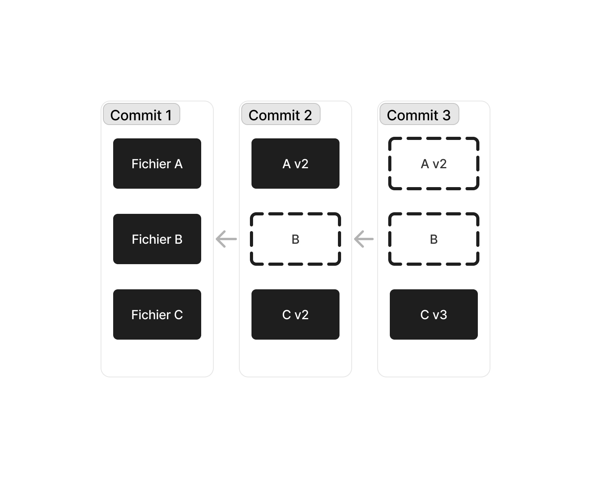
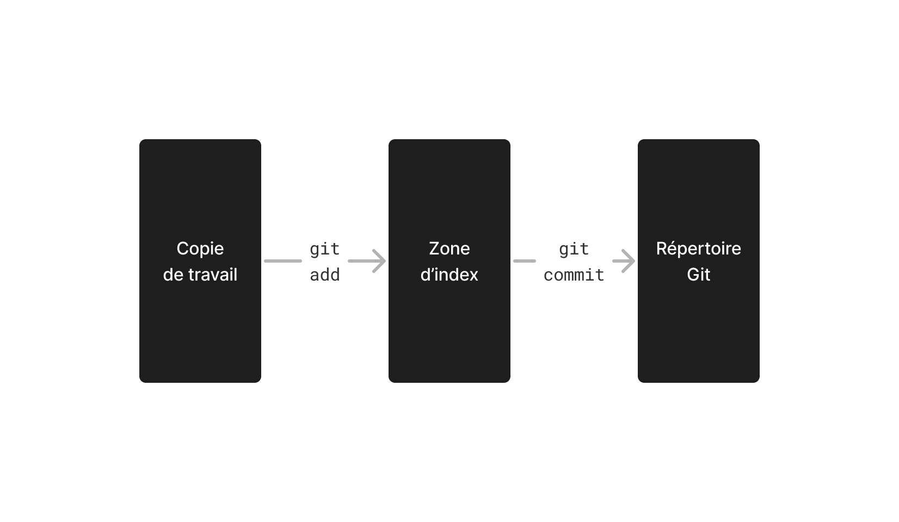
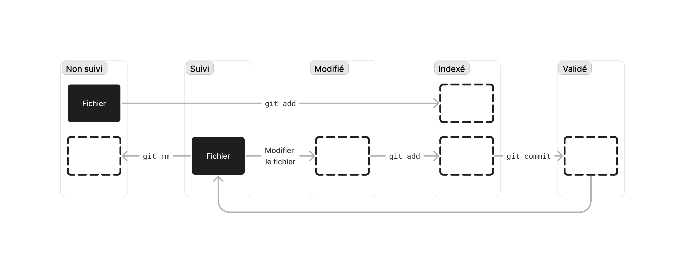
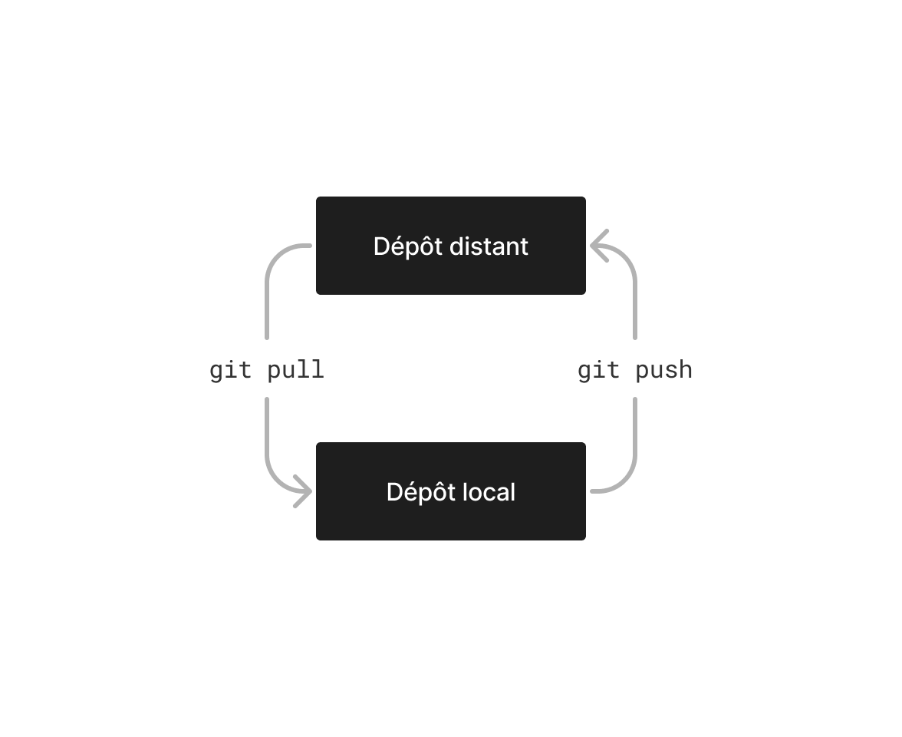

# Git 



Git est un gestionnaire de versions ; un système qui enregistre l'évolution de fichiers dans le temps. Il vous permet de ramener un fichier ou un projet complet à un état précédent, de visualiser les changements, de voir qui a modifié quoi quand, et plus encore.

Git fonctionne à la manière d'un **flux d'instantanés** (ou de clichés photographiques). À chaque fois que vous validez ou enregistrez (*commit*) l'état d'un projet, Git prend un instantané du contenu de votre espace de travail, et enregistre une référence à cet instantané. Il est ensuite possible de comparer l'état du projet entre deux instantanés, ou bien rétablir le projet à l'état d'un instantané précédent.

## 1. Les trois états de Git



Un projet Git (aussi appelé **dépôt**) contient trois états principaux, soit trois « endroits » où peuvent se trouver les fichiers en fonction de leur état à un moment donné : la **copie de travail** (*working copy*), la **zone d'index** (*staging area*), et le **répertoire Git** (*Git directory*).

L'utilisation de Git se passe normalement comme suit :

1. Vous modifiez des fichiers dans votre copie de travail.
2. Vous ajoutez les fichiers modifiés à la zone d'index avec la commande `git add`.
3. Vous validez vos changements avec `git commit`, ce qui enregistre l'instantané dans la base de données du répertoire Git.


## 2. Démarrer un dépôt Git

Il y a deux façons de démarrer un dépôt Git : soit **initialiser** un nouveau dépôt dans un répertoire, soit **cloner** un dépôt préexistant.

### 2.1. Initialiser un nouveau dépôt

Si vous commencez un nouveau projet, ou que vous désirez adopter un gestionnaire de version pour un projet existant, il suffit de se positionner dans celui-ci avec une interface en lignes de commandes :

```sh
cd chemin/vers/le/répertoire
```

Et d'exécuter ensuite la commande suivante :

```sh
git init
```

Cela crée un nouveau sous-répertoire caché[^1] nommé « .git » qui contient tous les fichiers nécessaires au dépôt.

[^1]: Comme leur nom l'indique, les fichiers et les dossiers cachées dont le nom débute par un point `.` ne sont pas visibles par défaut dans votre gestionnaire de fichiers. Sur Mac, dans l'application Finder, la commande `command + shit + .` affiche les fichiers et les dossiers cachées. Sur Windows, dans File Explorer, l'option ce trouve sous `View > Show > Hidden items`. Dans VS Code, l'option qui contrôle l'affichage des fichiers et des dossiers cachés s'appelle « Files: Exclude ».

<details>
<summary>

#### 2.1.1. Exercise

</summary>

1. Sur votre ordinateur, dans le répertoire où se trouvent vos projets de développement Web, créer un nouveau dossier « git-exercice », et initialisez-le.
2. Pour vous assurer du succès de l'initialisation, trouvez le sous-dossier « .git » de votre nouveau dépôt.

</details>

### 2.2. Cloner un dépôt existant

Si vous souhaitez travailler sur un dépôt Git existant — par exemple, un devoir ou un examen distribué avec GitHub Classroom — alors il est nécessaire de **cloner** (ou télécharger[^2]) une copie de celui-ci sur votre ordinateur.

Pour ce faire, positionnez-vous à l'endroit où vous désirez placer le dépôt, et exécuter la commande suivante avec une interface en lignes de commandes :

```sh
git clone url/du/dépôt
```

Ceci crée un nouveau répertoire, initialise un sous-répertoire « .git » à l'intérieur, récupère toutes les données du dépôt, et extrait une copie de travail de la dernière version.

[^2]: En réalité, *cloner* un dépôt n'est pas la même chose que le *télécharger*. Sur GitHub, par exemple, télécharger un dépôt ne fait que télécharger le répertoire sur votre ordinateur, sans initialiser celui-ci. Les commandes Git n'auront donc aucun effet sur le répertoire, et, plus important encore, le répertoire ne sera plus lié au dépôt distant d'où il provient.

<details>
<summary>

#### 2.2.1. Exercise

</summary>

Sur votre ordinateur, dans le répertoire où se trouvent vos projets de développement Web, clonez le dépôt [notes-de-cours](https://github.com/582-21W-MA/notes-de-cours).

Attention de ne pas cloner le dépôt dans un dossier « note-de-cours », mais bien directement à côté des autres projets. Votre dépôt ne devrait pas être dans un autre répertoire du même nom.

</details>

## 3. Enregistrer des modifications

Pour bien utiliser Git, il est important d'enregistrer ses modifications plus souvent qu'autrement. Il est recommandé de faire un instantané pour **chaque ensembles de modifications logiquement distinct**. Au minimum, enregistrez vos modifications lorsque votre programme atteint un état stable dont vous voulez garder une trace.

### 3.1. Cycle de vie des fichiers



Les fichiers de la copie de travail peuvent avoir différents états selon l'étape du cycle de vie dans lequel ils se trouvent. L'outil principal pour déterminer quels fichiers sont dans quel état est la commande `git status`, ou `git status -s` pour un affichage simplifié.

- **Non suivi** — Un fichier est « non suivi » s'il ne fait pas parti du dernier instantané (*commit*). On peut l'ajouter à l'index avec la commande `git add chemin/vers/le/fichier`, ou `git add .` pour indexer tous les fichiers non suivis.
- **Suivi** — Un fichier est « suivi » s'il fait parti du dernier instantané, mais qu'il est inchangé depuis. Un fichier suivi est un fichier que Git reconnaît, et que Git gardera à l'œil.
- **Modifié** — Une fois des changements faits, un fichier suivi devient « modifié ». Il n'est pas nécessaire d'exécuter une commande pour que Git remarque cette modification. Tout fichier suivi qui a subi un changement depuis le dernier instantané sera marqué comme tel par Git.
- **Indexé** — Un fichier indexé est un fichier modifié qui a été ajouté à la zone d'index avec la commande `git add`. Un fichier indexé est prêt à être valider.
- **Validé** — Enfin, tous les fichiers indexés sont validés lorsqu'un nouvel instantané est enregistré avec la commande `git commit`. Une fois validé, le fichier retourne automatiquement à l'état « suivi » en attendant de nouveaux changements.

<details>
<summary>

#### 3.1.1. Exercise

</summary>

1. Ajoutez un nouveau fichier vide au dépôt notes-de-cours, indexez celui-ci, et vérifiez ensuite son état.
2. Modifiez un fichier déjà suivi par Git, et ajoutez-le à la zone d'index. Vérifiez votre opération avec la commande appropriée.

</details>

### 3.2. Valider des modifications

Une fois que que la zone d'index contient tous les fichiers que vous désirez valider, il est temps d'enregistrer un instantané. La manière la plus simple est d'exécuter la commande suivante :

```sh
git commit -m "Message de validation"
```

Le message de validation détaille brièvement (72 caractères maximum) les changements effectués. Il est commun de formuler celui-ci à l'impératif, en suivant la formule : « Si appliqués, mon *commit* va ... [message] »

Par exemple, voici le message de validation pour un *commit* qui contient des corrections pour le présent fichier : 

```sh
git commit -m "Corriger fautes d'orthographe dans README.md"
```

Ou bien, voici le message de validation pour la soumission d'un travail pratique : 

```sh
git commit -m "Soumettre le TP pour la correction"
```

Enfin, voici un message de validation pour un *commit* qui tente de résoudre une erreur soulevée par l'enseignant·e lors de la correction :

```sh
git commit -m "Corriger lien/vers/le/commentaire"
```

<details>
<summary>

#### 3.2.1. Exercise

</summary>

1. Enregistrez un instantané des modifications faites pour l'exercice 3, et rédiger un message de validation approprié.
2. Une fois le *commit* fait, quel est l'état du fichier ajouté pour l'exercice 3 ?

<details><summary>Réponse</summary> Une fois validé, le fichier revient automatiquement à l'état « suivi ».</details>

</details>

### 3.3. Visualiser l'historique des validations

Après avoir créé plusieurs *commits*, ou si vous avez cloné un dépôt préexistant, il est possible de visualiser l'historique des validations. Pour ce faire, on exécute la commande `git log`.

Un historique Git ressemble généralement à ceci :

```
commit ca82a6dff817ec66f44342007202690a93763949
Author: Scott Chacon <schacon@gee-mail.com>
Date:   Mon Mar 17 21:52:11 2008 -0700

    change the version number

commit 085bb3bcb608e1e8451d4b2432f8ecbe6306e7e7
Author: Scott Chacon <schacon@gee-mail.com>
Date:   Sat Mar 15 16:40:33 2008 -0700

    remove unnecessary test

commit a11bef06a3f659402fe7563abf99ad00de2209e6
Author: Scott Chacon <schacon@gee-mail.com>
Date:   Sat Mar 15 10:31:28 2008 -0700

    first commit
```

Par défaut, Git énumère les *commits* en ordre chronologique inversé. Les *commits* les plus récents apparaissent donc en premier.

Vous observerez aussi que chaque *commit* est identifié par une suite de caractères unique, communément appelée Git ID, SHA ou *hash*.

### 3.4. Visiter une validation précédente

Avec Git, il est possible de voyager dans le temps, et de visiter notre projet aux différentes étapes de son existence. Pour ce faire, il faut d'abord s'assurer que notre copie de travail est « propre », c'est-à-dire qu'elle ne contient aucun fichiers modifiés. Si c'est le cas, on peut exécuter la commande suivante pour rétablir notre copie de travail à un *commit* donné :

```sh
git checkout ID-du-commit
```

N'oubliez pas de revenir dans le présent avant de créer de nouveaux *commits*. Pour ramener votre copie de travail à la dernière validation effectuée, il faut exécuter la commande suivante :

```sh
git checkout main
```

<details>
<summary>

#### 3.4.1. Exercise

</summary>

1. Rétablissez votre copie de travail à un état précédent, et observez l'état des différents fichiers du dépôt.
2. Ramener ensuite votre copie de travail à la validation la plus récente.

</details>

### 3.5. Ignorer des fichiers

Certains fichiers ne sont pas pertinents à indexer. C'est le cas, par exemple, des fichiers `.DS_Store` sur Mac, des dossiers de configuration `.vscode`, des dossiers `node_modules`, et de tous autres fichiers personnels ou confidentiels.

On peut énumérer les patrons de noms des fichiers et des répertoires à ignorer dans un fichier `.gitignore`. Voici un exemple de fichier `.gitignore` typique :

```sh
# System files
# ------------
Icon
.DS_Store

# Editors
# (sensitive workspace files)
# ---------------------------
*.sublime-workspace
/.vscode
/.idea

# Dependency directories
# ----------------------
node_modules/
```

## 4. Travailler avec des dépôts distants

Pour pouvoir collaborer sur un projet Git, il est nécessaire de savoir comment gérer les dépôts distants. Les dépôts distants sont des versions de votre projet qui sont « ailleurs » ; sur Internet, sur le réseau d'une organisation, ou même sur votre ordinateur. Collaborer avec d'autres personnes consiste à gérer ces dépôts distants, en poussant ou tirant des données depuis et vers ces dépôts quand vous souhaitez partager votre travail.

### 4.1. Afficher les dépôts distants

Pour visualiser les dépôts distants associés à un dépôt local, on utilise la commande `git remote`. Si vous exécutez `git remote` dans le présent dépôt, vous devriez voir « origin » — le nom donné par défaut au dépôt distant à partir duquel vous avez cloné votre projet Git.

Vous pouvez aussi ajouter l'option `-v` à la commande `git remote` pour voir l'URL des dépôts distants.

### 4.2. Ajouter et retirer des dépôts distants

Pour ajouter un dépôt distant à votre projet Git, il suffit d'exécuter la commande suivante à l'intérieur de votre dépôt local :

```sh
git remote add [nom] [url]
```

Pour retirer un dépôt distant, on utilise la commande suivante :

```sh
git remote rm [nom]
```

### 4.3. Tirer et pousser son travail



Si vous avez cloné votre dépôt, celui-ci est automatiquement configuré pour suivre les changements du dépôt distant duquel vous l'avez cloné. Pour tirer (*pull*) ces changements et les appliquer à votre dépôt local, il faut exécuter la commande `git pull`. Attention, pour éviter les conflits, assurez-vous que votre dépôt local est « propre » avant de tirer des changements.

Inversement, lorsque votre dépôt contient des *commits* que vous désirez partager, il faut les pousser (*push*) en amont. La commande pour le faire est `git push`. Attention, votre dépôt local doit être à jour avec le dépôt distant pour pouvoir poussez vers ce dernier.

<details>
<summary>

#### 4.3.1. Exercise

</summary>

Créez un nouveau dépôt sur GitHub contenant un fichier README.md, et clonez celui-ci sur votre ordinateur. Modifiez ensuite le fichier README.md, et poussez vos changements en amont.

</details>

## 5. Ressources

- [Pro Git (livre de référence)](https://www.git-scm.com/book/en/v2)
- [Missing Semester : Version Control](https://missing.csail.mit.edu/2020/version-control/)