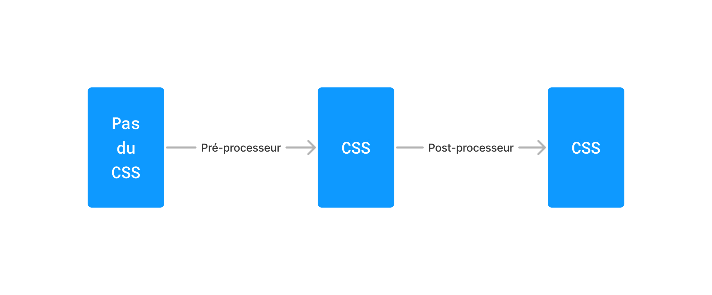

# Les pré- et post-processeurs CSS

Un pré-processeur CSS est un programme qui permet de convertir
des fichiers écrits dans un langage autre que CSS en des fichiers
CSS que les navigateurs peuvent interpréter. Les pré-processeurs
tels [SCSS](https://sass-lang.com) ou [LESS](https://lesscss.org)
permettent d'utiliser des fonctionnalités qui ne sont pas, ou
pas encore, intégrées dans le langage CSS : règles imbriquées,
*mixins*, fonctions, et plus encore.

Un post-processeur CSS est un programme qui permet de transformer des
fichiers CSS de sorte à rendre leur conception plus ergonomique. [CSS
Modules](https://github.com/css-modules/css-modules), par exemple,
transforme les fichiers CSS afin que leur portée soit locale.
Certains transcompilateurs transforment le CSS moderne afin qu'ils
soient compris par davantage de navigateurs.
